# React + Vite Boilerplate

Um boilerplate robusto e rico em funcionalidades para construir aplicações React modernas com Vite. Este projeto foi desenhado para fornecer uma base sólida com as melhores práticas, incluindo TypeScript, suporte a PWA e uma configuração flexível para bibliotecas de UI.

> ⚠️ **Evolução:** Este repositório é a continuação direta do projeto [react-layered-boilerplate](https://github.com/tiagovilasboas/react-layered-boilerplate), incorporando Mantine, Vite 7 e novas práticas de automação (Husky, Commitlint, CI GitHub Actions, etc.).

[](LICENSE)


Um boilerplate React robusto e escalável, construído com as ferramentas mais modernas do ecossistema Frontend. Ele combina a velocidade do **Vite** com a produtividade do **Mantine** (biblioteca de componentes + design system), tudo isso sobre uma **Arquitetura em Camadas** inspirada na Clean Architecture.

Este projeto é o sucessor espiritual do [react-layered-boilerplate](https://github.com/tiagovilasboas/react-layered-boilerplate), atualizado para as melhores práticas de 2024.

---

## 📚 Índice

- [✨ Features](#-features)
- [🏛️ Arquitetura](#-arquitetura)
- [🧩 Geradores de Código (Plop)](#-geradores-de-código-plop)
- [🔤 Internacionalização](#-internacionalização)
- [📊 Avaliação](#-avaliação)
- [🚀 Deploy](#-deploy)
- [❓ FAQ](#-faq)
- [🗺️ Roadmap](#-roadmap)
- [📝 Changelog](#-changelog)
- [🤝 Contribuindo](#-contribuindo)
- [📄 Licença](#-licença)

---

## ✨ Features

- ⚡️ **Vite:** Build ultrarrápido e Hot Module Replacement (HMR) instantâneo.
- ⚛️ **React 18:** Com todos os hooks e features mais recentes.
- 🔵 **TypeScript:** Tipagem estrita para um código mais seguro e manutenível.
- 🎨 **Mantine:** Biblioteca de componentes React completa e acessível, com suporte a temas e estilo via Emotion.
- 🧪 **Vitest & Testing Library:** Configuração de testes moderna, rápida e integrada ao Vite.
- 📐 **ESLint & Prettier:** Qualidade de código e formatação garantidas.
- 🐶 **Husky & lint-staged:** Hooks de pre-commit para rodar testes e linters antes de cada commit.
- 📦 **Alias de Importação:** Importe de `@/components` em vez de `../../../components`.
- 🌐 **PWA Ready:** Suporte para Progressive Web App.
- 🌙 **Dark Mode:** Tema escuro com um clique.
- 🏛️ **Arquitetura em Camadas:** Código organizado, escalável e fácil de testar.
- ✨ **Prettier Sort Imports & ESLint Simple Import Sort:** Imports organizados automaticamente.
- 👀 **ESLint a11y & FormatJS:** Acessibilidade e internacionalização enforced.
- 🌍 **i18n pronto:** Configuração out-of-the-box com i18next + react-i18next (PT/EN).
- 🤖 **Geradores Plop:** Crie componentes ou features completas (API, store, componente, teste) com um comando.
- 🐹 **Commitlint + Commitizen:** Histórico de commits padronizado (Conventional Commits).

## 🏛️ Arquitetura

Este boilerplate foi construído em torno de princípios de engenharia de software reconhecidos:

* **SRP (Single-Responsibility Principle)** – cada função, componente ou módulo tem um único motivo para mudar.
* **DRY (Don't Repeat Yourself)** – abstrações e utilitários compartilhados evitam duplicação de código.
* **KISS (Keep It Simple, Stupid)** – preferimos soluções simples e legíveis a abstrações desnecessárias.
* **YAGNI (You Aren't Gonna Need It)** – só adicionamos código quando há uma necessidade real, mantendo o projeto enxuto.

A estrutura em camadas respeita fortemente a **Dependency Rule** da Clean Architecture: dependências sempre apontam do exterior para o interior (UI ➡️ Hooks ➡️ Services). Isso garante que detalhes técnicos (framework, API) nunca sejam acoplados à lógica de domínio, facilitando testes, manutenção e evolução.

A estrutura do projeto é inspirada na **Clean Architecture**, dividindo a aplicação em camadas de responsabilidade. Isso garante que a lógica de negócio seja independente dos detalhes de implementação da UI ou do acesso a dados.

```
src/
├── app/                  # Configurações globais, providers, rotas
├── components/           # Componentes de UI compartilhados (ex: Button, Input)
├── features/             # Módulos/Features da aplicação (ex: `user-auth`, `product-list`)
│   └── example-feature/
│       ├── components/   # Componentes específicos da feature
│       ├── hooks/        # Hooks com a lógica da UI da feature
│       ├── services/     # Camada de acesso a dados (API, localStorage)
│       └── types.ts      # Tipos específicos da feature
├── hooks/                # Hooks globais
├── lib/                  # Utilitários (ex: cn, date-fns)
├── stores/               # Stores globais (Zustand)
└── types/                # Tipos globais da aplicação
```

### fluxo de dados

```mermaid
flowchart TD
  UI["Componentes \n(UI)"] --> Hooks["Hooks \n(Lógica de Estado)"]
  Hooks --> Services["Services \n(Acesso a Dados)"]
  Services -->|HTTP / Storage| Sources[("APIs / DB / Cache")]
  style UI fill:#8fc7ff,stroke:#333,stroke-width:1px
  style Hooks fill:#ffd47d,stroke:#333,stroke-width:1px
  style Services fill:#a4e8a4,stroke:#333,stroke-width:1px
  style Sources fill:#e0e0e0,stroke:#333,stroke-width:1px
```



## 🚀 Começando

### Pré-requisitos

- [Node.js](https://nodejs.org/) (versão 18 ou superior)
- [npm](https://www.npmjs.com/) ou [yarn](https://yarnpkg.com/)

### Instalação

1.  Clone o repositório:
    ```bash
    git clone https://github.com/tiagovilasboas/react-vite-boilerplate.git
    ```
2.  Entre no diretório do projeto:
    ```bash
    cd react-vite-boilerplate
    ```
3.  Instale as dependências:
    ```bash
    npm install
    ```
4.  Rode o servidor de desenvolvimento:
    ```bash
    npm run dev
    ```

## 🛠️ Scripts Disponíveis

| Comando              | Descrição                                                  |
| -------------------- | ---------------------------------------------------------- |
| `npm run dev`        | Mata a porta 5173 se necessário e inicia o Vite.           |
| `npm run dev:open`   | Mesmo que o anterior, abrindo o navegador automaticamente. |
| `npm run build`      | Compila a aplicação para produção.                         |
| `npm run preview`    | Serve o build de produção localmente para teste.           |
| `npm run test`       | Roda os testes com Vitest.                                 |
| `npm run test:ci`    | Testes + coverage (usado no CI).                           |
| `npm run lint`       | Executa o ESLint para encontrar problemas no código.       |
| `npm run format`     | Prettier + ESLint ‟--fix" (mantém código formatado).       |
| `npm run clean`      | Limpa `dist` e cache Vite.                                 |
| `npm run type-check` | Verifica erros de tipagem TypeScript em todo o projeto.    |

## 📦 Biblioteca de Componentes

Este boilerplate já vem configurado com **Mantine**. Para começar a usar:

1.  Os estilos globais já são importados em `src/main.tsx`:
    ```tsx
    import '@mantine/core/styles.css'
    ```
2.  Use qualquer componente normalmente:

    ```tsx
    import { Button } from '@mantine/core'

    function MyComponent() {
      return <Button>Mantine Rocks 🚀</Button>
    }
    ```

## 🤝 Contribuindo

Contribuições são o que fazem a comunidade open source um lugar incrível para aprender, inspirar e criar. Qualquer contribuição que você fizer será **muito apreciada**.

1.  Faça um **Fork** do projeto
2.  Crie sua **Branch de Feature** (`git checkout -b feature/AmazingFeature`)
3.  **Commite** suas mudanças (`git commit -m 'feat: Add some AmazingFeature'`)
4.  **Push** para a Branch (`git push origin feature/AmazingFeature`)
5.  Abra um **Pull Request**

## 📄 Licença

Distribuído sob a licença MIT. Veja `LICENSE` para mais informações.

## 👨‍💻 Autor

**Tiago Vilas Boas**

- **LinkedIn:** [@tiagovilasboas](https://www.linkedin.com/in/tiagovilasboas/)
- **GitHub:** [@tiagovilasboas](https://github.com/tiagovilasboas)

---

Desenvolvido de dev para dev com ❤️.

## 🧩 Geradores de Código (Plop)

Este projeto utiliza [Plop](https://plopjs.com/) para acelerar a criação de código padronizado.

| Comando | O que faz |
| ------- | --------- |
| `npm run plop -- component` | Gera um componente isolado em `src/components/` com teste. |
| `npm run plop -- feature`   | Gera uma feature completa: API fake, store Zustand, componente Mantine e testes, tudo em `src/features/<feature>/`. |

Basta responder ao prompt com o nome desejado e o código será gerado automaticamente seguindo a arquitetura.

### Exemplo rápido

```bash
# Gerar uma feature chamada counter
npm run plop -- feature
# 👉 Responda "counter" no prompt e veja os arquivos criados em src/features/counter
```

## 🔤 Internacionalização

O boilerplate já vem configurado com **i18next** + **react-i18next**:

1. Arquivo de inicialização: `src/i18n.ts` (importado em `src/main.tsx`).
2. Recursos de idiomas em `src/locales/{pt,en}/common.json`.
3. Use o hook `useTranslation()` em qualquer componente:

```tsx
import { useTranslation } from 'react-i18next'

function Counter() {
  const { t } = useTranslation()
  return <span>{t('currentValue', { value: 42 })}</span>
}
```

Por padrão o idioma inicial é **PT-BR**, mas basta alterar `lng` em `i18n.ts` ou implementar um seletor de idioma.

## 📊 Avaliação

### Nota Geral

**9/10**

### Onde este boilerplate se encaixa melhor

- **Dashboards & Admins internos** – CRUDs, tabelas, gráficos.
- **SaaS B2B / B2C** de pequeno a médio porte – apps multi-idioma com necessidade de escalar.
- **MVPs / POCs** que podem evoluir em produto – entrega rápida sem sacrificar qualidade.
- **PWAs offline-first** – plugin PWA já configurado, divisão de chunks otimizada.
- **Portais corporativos** que consomem APIs REST/GraphQL – fluxo em camadas facilita mudanças no backend.

### Classificação Detalhada

| Critério                | ⭐ (0-5) | Comentário                                                                            |
| ----------------------- | :-----: | -------------------------------------------------------------------------------------- |
| Produtividade Dev       | **5**   | Vite, HMR, Plop, scripts conveniência.                                                 |
| Escalabilidade Código   | **4**   | Camadas + Zustand modulares; faltam micro-frontends/SSR built-in.                     |
| Qualidade & Manutenção  | **5**   | ESLint completo, Prettier, testes, CI.                                                |
| Experiência de UI       | **4**   | Mantine cobre 90 %; pode exigir custom DS avançado em alguns casos.                   |
| Complexidade Inicial    | **3**   | Tooling avançado (husky, commitlint) exige curva curta, mas documentação ajuda.       |

> Para chegar a 10/10 seriam necessários: SSR para SEO crítico, Storybook/Ladle out-of-the-box e integração padrão de autenticação/cache de dados.

## 🚀 Deploy

Para instruções completas de deploy consulte **[docs/DEPLOY.md](docs/DEPLOY.md)**.

## ❓ FAQ

FAQ disponível em **[docs/FAQ.md](docs/FAQ.md)**.

## 🗺️ Roadmap

Roadmap atualizado em **[docs/ROADMAP.md](docs/ROADMAP.md)**.

## 📝 Changelog

Histórico de versões: **[docs/CHANGELOG.md](docs/CHANGELOG.md)**.

---
